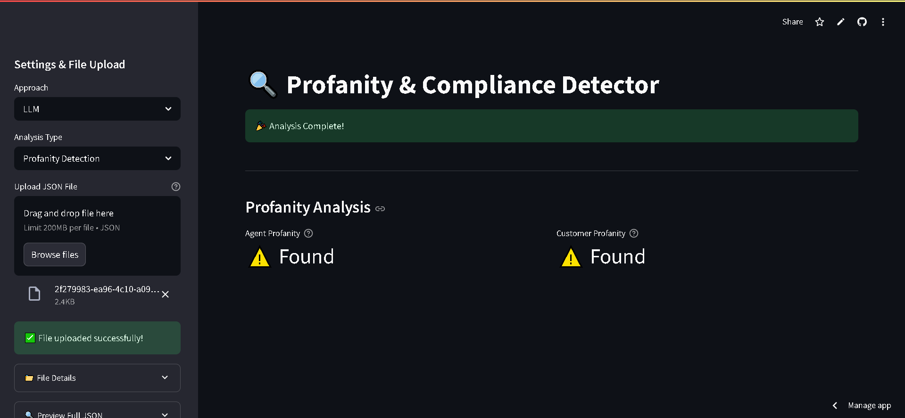

# 🔍 Debt Collection Conversation Analyzer

  

A comprehensive compliance analysis tool for debt collection conversations, leveraging both pattern matching and AI-powered analysis to detect regulatory violations.

[](https://conversation-analyzer.streamlit.app/)
[](https://github.com/Kokush1bo/Conversation-Analyzer)

## 📌 Features

### 🔎 Compliance Analysis
- **Profanity Detection**: Identify inappropriate language from both agents and borrowers
- **Privacy Violations**: Detect unauthorized disclosure of personal information

### ⚙️ Dual Analysis Approaches
- **Pattern Matching**: Fast regex-based detection for known violation patterns
- **LLM Analysis**: Advanced detection using fine-tuned BERT model

## 🚀 Quick Start

1. **Access the App**:  
   Visit [conversation-analyzer.streamlit.app](https://conversation-analyzer.streamlit.app/)

2. **Upload Conversations**:  
   Provide your debt collection conversation logs in YAML format

3. **Configure Analysis**:  
   Select analysis type and preferred detection method

4. **Review Results**:  
   View detailed compliance report with highlighted violations

## 🛠️ Development Setup

```bash
# Clone the repository
git clone https://github.com/Kokush1bo/Conversation-Analyzer.git

# Navigate to project directory
cd Conversation-Analyzer

# Install dependencies
pip install -r requirements.txt

# Run the app locally
streamlit run app.py